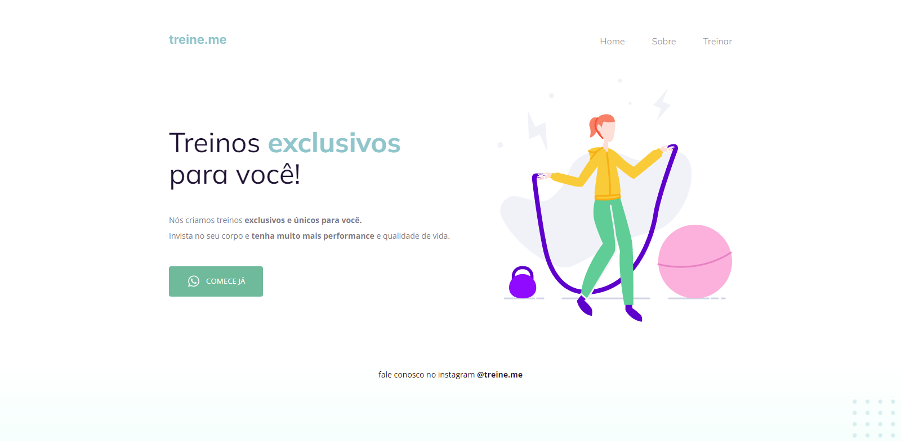

<h1 align="center">
	Recriando Layout - Stage 2 Explorer - Rocketseat 
</h1>

<h3 align="center">
	Primeiro desafio do stage 2 do treinamento explorer
</h3>
 

<h4 align="center">
	Status: 🚀 Finalizado
</h4>

	<a href="#about">Sobre</a> •
	<a href="#tech-stack">Tecnologias</a> 

## Sobre

Desafio proposto na trilha explorer, que foi proposto a refatorarmos o código com tags html semânticas para que os motores de buscas tenham mais facilidade de compreender a intenção daa nossa página, assim também melhorando na questão da acessibilidade

## Estilização do projeto

## Tecnologias

&nbsp;
&nbsp;
